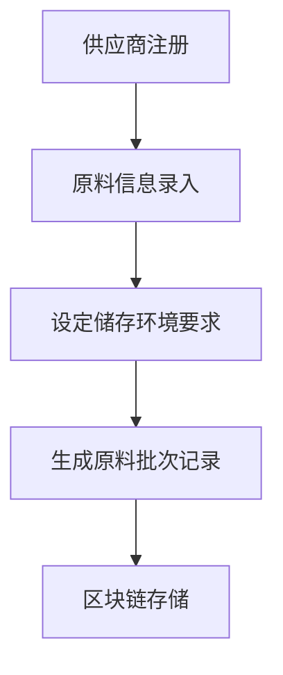
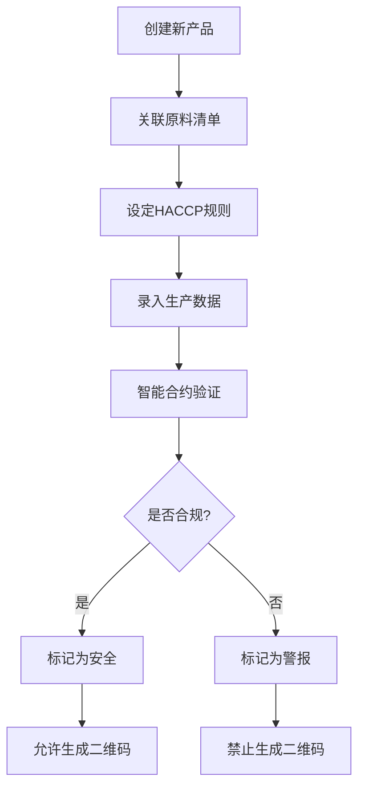
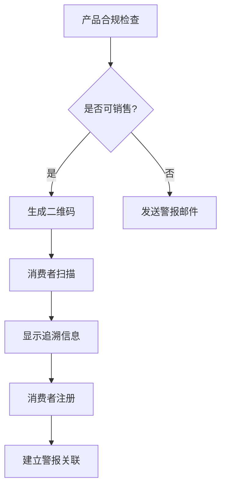

# NutriGuard - 区块链食品追溯系统

<p align="center">
  
  
  
  
</p>

## 📖 项目简介

**NutriGuard** 是一个基于区块链技术的食品追溯应用系统，旨在确保商家能够快速从市场和消费者手中召回受污染的食品，同时消费者可以通过扫描二维码来检查产品状态。系统利用区块链技术的透明性、不变性和去中心化特性来增强食品安全和消费者信任。

本项目专为**西餐厅**等餐饮企业设计，提供从原料采购到最终销售的全链条食品安全追溯解决方案。

## 🏗️ 系统架构

```
┌─────────────────┐    ┌─────────────────┐    ┌─────────────────┐
│   Flutter App   │    │  Smart Contract │    │      IPFS       │
│   (移动端界面)    │◄──►│   (区块链逻辑)    │◄──►│   (文件存储)     │
└─────────────────┘    └─────────────────┘    └─────────────────┘
         │                       │                       │
         │                       │                       │
         ▼                       ▼                       ▼
┌─────────────────┐    ┌─────────────────┐    ┌─────────────────┐
│   MetaMask      │    │   Ethereum      │    │  质量控制系统    │
│   (钱包认证)     │    │   (区块链网络)    │    │   (HACCP规则)   │
└─────────────────┘    └─────────────────┘    └─────────────────┘
```

## 🔧 技术栈

### 区块链层
- **智能合约**: Solidity ^0.8.28
- **开发框架**: Hardhat ^2.26.3
- **区块链网络**: Ethereum (支持本地测试网和Sepolia测试网)
- **安全库**: OpenZeppelin Contracts ^5.4.0

### 前端应用
- **框架**: Flutter ^3.8.1
- **状态管理**: Provider ^6.1.1
- **路由管理**: GoRouter ^12.1.3
- **区块链交互**: Web3Dart ^2.7.3
- **二维码功能**: QR Flutter ^4.1.0, Mobile Scanner ^3.5.6
- **钱包集成**: Reown AppKit ^1.0.1

### 存储与集成
- **去中心化存储**: IPFS (用于存储产品图片和证书)
- **本地存储**: SharedPreferences ^2.2.2
- **数据格式**: JSON

## 🚀 核心功能

### 🏪 商家功能

#### 1. 身份验证与管理
- 通过MetaMask钱包进行去中心化身份认证
- 支持商家和消费者角色注册
- 安全的私钥管理

#### 2. 供应商管理
- 注册和管理供应商信息
- 记录供应商认证证书
- 维护供应商联系信息和活跃状态

#### 3. 原料追溯系统
- **原料信息录入**：
  - 原料名称、分类、UPC码
  - 生产日期、保质期、批次号
  - 供应商关联信息
  - 储存环境要求（温度、湿度范围）
  - 重量信息
- **状态管理**：
  - 实时更新原料状态（安全/污染/召回）
  - 支持手动标记污染原料
  - 自动关联受影响产品

#### 4. 食品生产管理
- **产品创建**：
  - 产品基本信息（名称、描述、UPC码）
  - 产品分类（主食/小食/饮料）
  - 关联使用的原料清单
  - 上传产品图片和证书至IPFS
- **HACCP质量控制**：
  - 设定国际标准的质量控制规则
  - 温度范围控制（最低/最高温度）
  - 湿度环境监控
  - 重量使用范围
  - pH值控制（饮料类产品）
- **生产数据验证**：
  - 实时录入生产过程数据
  - 智能合约自动验证合规性
  - 不合规产品自动标记为"警报"状态

#### 5. 销售与二维码管理
- **二维码生成**：
  - 仅合规产品可生成二维码
  - 唯一产品标识码
  - 包含完整追溯信息
- **销售记录**：
  - 记录销售时间和状态
  - 关联消费者注册信息

#### 6. 智能警报系统
- **自动召回机制**：
  - 原料污染时自动标记相关产品
  - 向已注册消费者发送警报邮件
  - 阻止污染产品生成二维码
- **质量预警**：
  - 生产数据不合规时发送警报
  - 详细说明不合规原因

### 👥 消费者功能

#### 1. 产品验证与追溯
- **二维码扫描**：
  - 使用手机摄像头扫描产品二维码
  - 实时获取产品完整追溯信息
- **信息可视化**：
  - 产品状态显示（安全/警报/污染）
  - 生产日期和保质期信息
  - 原料来源和供应商信息
  - 生产过程质量数据

#### 2. 安全警报注册
- **产品注册**：
  - 扫描后可选择注册产品
  - 绑定个人邮箱地址
  - 建立产品-消费者关联
- **自动通知**：
  - 产品原料出现问题时自动接收邮件通知
  - 召回信息和安全建议
  - 商家联系方式

#### 3. 反馈系统
- **产品评价**：
  - 提交产品质量反馈
  - 1-5星评分系统
  - 详细文字描述
- **问题报告**：
  - 发现问题时快速反馈给商家
  - 反馈信息存储在区块链上
  - 保证反馈的真实性和不可篡改性

## 🔄 业务流程

### 阶段一：原料收集


1. **供应商注册**：商家在系统中注册供应商详细信息
2. **原料录入**：录入原料名称、UPC码、生产日期、保质期、批号等
3. **环境设定**：设置储存温度和湿度要求
4. **区块链记录**：所有信息写入区块链，形成不可篡改记录

### 阶段二：生产过程


1. **产品创建**：录入产品信息，选择使用的原料
2. **规则设定**：根据HACCP标准设定质量控制规则
3. **数据录入**：手动输入实际生产过程数据
4. **自动验证**：智能合约验证数据是否符合预设标准
5. **状态更新**：根据验证结果更新产品状态

### 阶段三：销售与追溯


1. **合规检查**：验证产品和原料状态
2. **二维码生成**：仅合规产品可生成销售二维码
3. **消费者扫描**：获取完整产品追溯信息
4. **注册警报**：消费者可注册接收安全警报

## 📱 系统界面

### 商家端界面
- **仪表板**：显示系统概览和关键指标
- **供应商管理**：供应商列表、详情和创建页面
- **原料管理**：原料清单、状态监控和添加功能
- **产品管理**：产品列表、生产状态和质量控制
- **质量控制**：HACCP规则设定和生产数据录入
- **二维码生成器**：为合规产品生成销售二维码
- **反馈管理**：查看和处理消费者反馈

### 消费者端界面
- **二维码扫描器**：快速扫描产品二维码
- **产品详情**：完整的产品追溯信息展示
- **我的警报**：注册的产品和接收的安全通知
- **反馈提交**：产品评价和问题反馈
- **个人资料**：账户信息和设置

## 🛠️ 安装与部署

### 前置要求
- Node.js >= 16.0.0
- Flutter SDK >= 3.8.1
- Git
- MetaMask 浏览器扩展或移动应用

### 1. 克隆项目
```bash
git clone <repository-url>
cd nutriguard
```

### 2. 区块链环境设置
```bash
cd Blockchain
npm install
```

#### 启动本地区块链网络
```bash
npx hardhat node
```

#### 部署智能合约
```bash
npx hardhat run scripts/deploy.js --network localhost
```

### 3. Flutter应用设置
```bash
cd nutri_guard
flutter pub get
```

#### 配置网络地址
编辑 `lib/config/app_config.dart`，更新以下配置：
```dart
static const String ethereumRpcUrl = 'http://YOUR_IP:8545';
static const String nutriGuardContractAddress = 'DEPLOYED_CONTRACT_ADDRESS';
```

#### 运行应用
```bash
flutter run
```

### 4. MetaMask配置
1. 添加本地网络：
   - 网络名称: Hardhat Local
   - RPC URL: http://localhost:8545
   - Chain ID: 1337
   - 货币符号: ETH

2. 导入测试账户：
   - 商家账户私钥: `0x59c6995e998f97a5a0044966f0945389dc9e86dae88c7a8412f4603b6b78690d`
   - 消费者账户私钥: `0xac0974bec39a17e36ba4a6b4d238ff944bacb478cbed5efcae784d7bf4f2ff80`

## 🧪 测试

### 智能合约测试
```bash
cd Blockchain
npx hardhat test
```

### Flutter应用测试
```bash
cd nutri_guard
flutter test
```

## 📋 使用指南

### 商家操作流程
1. **初始设置**：
   - 使用MetaMask连接商家账户
   - 注册为商家角色
   - 添加供应商信息

2. **原料管理**：
   - 录入新到货原料信息
   - 设置储存环境要求
   - 监控原料状态

3. **产品生产**：
   - 创建新产品，关联原料
   - 设定HACCP质量控制规则
   - 录入实际生产数据
   - 等待智能合约验证

4. **销售准备**：
   - 检查产品合规状态
   - 为合格产品生成二维码
   - 打印二维码标签

5. **问题处理**：
   - 接收到供应商污染通知时，标记相关原料
   - 查看受影响产品列表
   - 系统自动向消费者发送警报

### 消费者操作流程
1. **产品验证**：
   - 打开应用，选择扫描功能
   - 扫描产品二维码
   - 查看完整追溯信息

2. **安全注册**：
   - 在产品详情页面选择"注册"
   - 输入邮箱地址
   - 确认注册

3. **反馈提交**：
   - 在产品页面选择"反馈"
   - 填写评价和问题描述
   - 提交反馈

## 🔒 安全特性

### 区块链安全
- **不可篡改性**：所有数据写入区块链后无法修改
- **透明性**：所有交易和状态变更公开可查
- **去中心化**：无单点故障，提高系统可靠性

### 智能合约安全
- **访问控制**：严格的权限管理，防止未授权操作
- **重入攻击防护**：使用OpenZeppelin的ReentrancyGuard
- **输入验证**：全面的参数验证和边界检查
- **事件日志**：详细的操作日志用于审计

### 应用安全
- **钱包认证**：基于MetaMask的安全身份验证
- **数据加密**：敏感数据本地加密存储
- **网络安全**：HTTPS通信和API安全

## 🌟 核心优势

1. **食品安全保障**：
   - 端到端的食品追溯
   - 实时质量监控
   - 快速召回机制

2. **技术先进性**：
   - 区块链技术保证数据真实性
   - 智能合约自动化验证
   - IPFS去中心化存储

3. **用户体验**：
   - 简洁直观的移动应用界面
   - 一键扫描获取完整信息
   - 自动化警报系统

4. **合规性**：
   - 符合HACCP国际标准
   - 支持食品安全法规要求
   - 完整的审计追踪

## 🚧 发展路线图

### 版本 1.1.0 (计划中)
- [ ] 支持更多区块链网络（Polygon, BSC）
- [ ] 集成IoT传感器自动数据采集
- [ ] 多语言支持
- [ ] 高级数据分析和报告功能

### 版本 1.2.0 (规划中)
- [ ] 供应链金融集成
- [ ] AI驱动的质量预测
- [ ] 跨链互操作性
- [ ] 企业级管理控制台

## 🤝 贡献指南

我们欢迎社区贡献！请遵循以下步骤：

1. Fork 本项目
2. 创建功能分支 (`git checkout -b feature/AmazingFeature`)
3. 提交更改 (`git commit -m 'Add some AmazingFeature'`)
4. 推送到分支 (`git push origin feature/AmazingFeature`)
5. 创建 Pull Request

## 📄 许可证

本项目采用 MIT 许可证。详情请参阅 [LICENSE](LICENSE) 文件。

## 📞 联系我们

- **项目维护者**: NutriGuard Team
- **邮箱**: contact@nutriguard.com
- **官网**: https://nutriguard.com

## 🙏 致谢

感谢以下开源项目和社区的支持：
- [OpenZeppelin](https://openzeppelin.com/) - 智能合约安全库
- [Flutter](https://flutter.dev/) - 跨平台移动开发框架
- [Hardhat](https://hardhat.org/) - 以太坊开发环境
- [IPFS](https://ipfs.io/) - 去中心化存储网络

---

**⚠️ 免责声明**: 本项目仅用于演示和教育目的。在生产环境中使用前，请进行充分的安全审计和测试。
